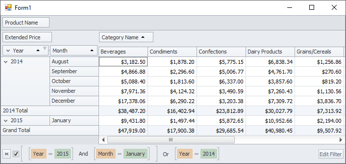

<!-- default badges list -->

<!-- default badges end -->

# Pivot Grid for WinForms - How to Implement Group Filter

This example demonstrates how to create group filters in the Pivot Grid. 

Set the [PivotGroupFilterValues.FilterType](https://docs.devexpress.com/CoreLibraries/DevExpress.XtraPivotGrid.PivotGroupFilterValues.FilterType) property to [PivotFilterType.Included](https://docs.devexpress.com/CoreLibraries/DevExpress.XtraPivotGrid.PivotFilterType). Create filter values and add them to the [PivotGroupFilterValues.Values](https://docs.devexpress.com/CoreLibraries/DevExpress.XtraPivotGrid.PivotGroupFilterValues.Values) and [PivotGroupFilterValue.ChildValues](https://docs.devexpress.com/CoreLibraries/DevExpress.XtraPivotGrid.PivotGroupFilterValue.ChildValues) collections.

## Files to Reiew

* [Form1.cs](./CS/GroupFilter/Form1.cs) (VB: [Form1.vb](./VB/GroupFilter/Form1.vb))

## Documentation

- [Pop-up Filter](https://docs.devexpress.com/WindowsForms/8554/controls-and-libraries/pivot-grid/data-shaping/filtering/pop-up-filter)
- [Field Groups](https://docs.devexpress.com/WindowsForms/1958/controls-and-libraries/pivot-grid/layout/field-groups)

